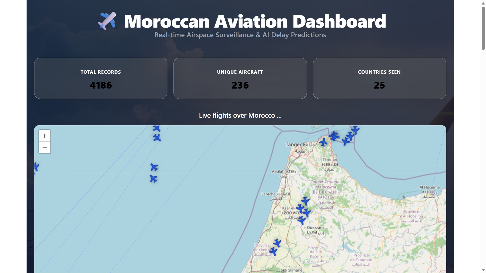
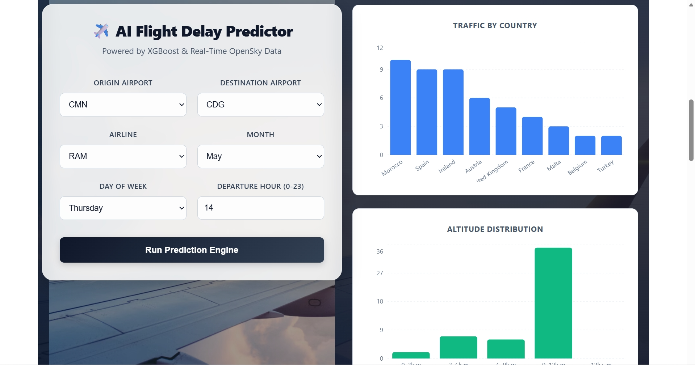
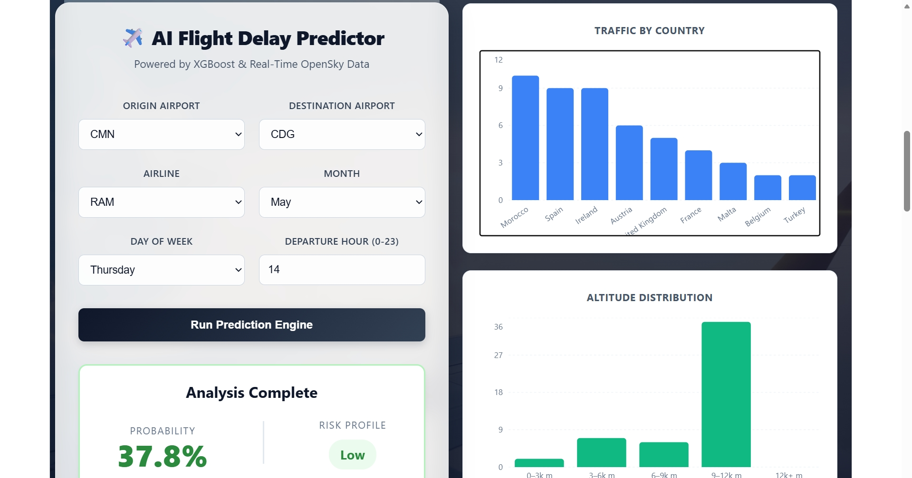
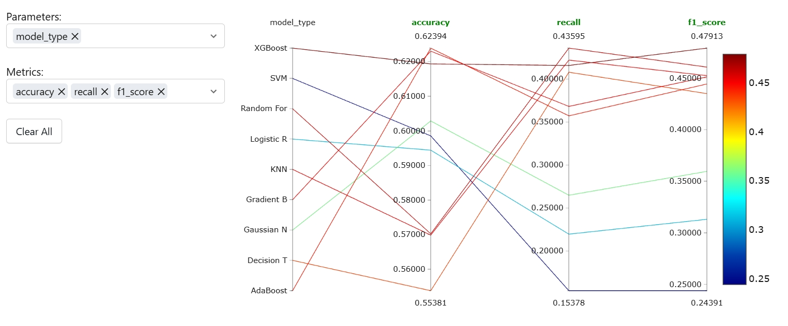
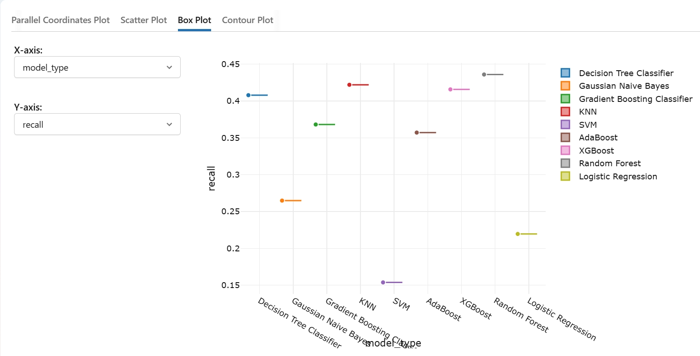
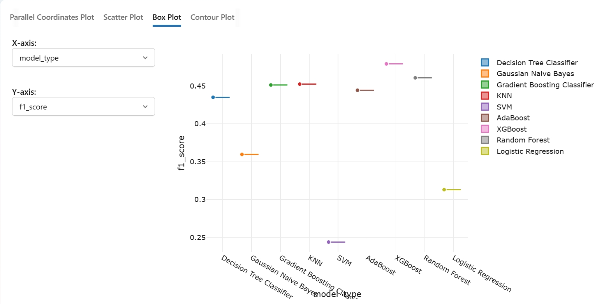

# ✈️ Morocco Aviation Analytics Dashboard

> **Full-Stack Real-Time Aviation Surveillance System with AI-Powered Delay Prediction**

A production-ready web application that tracks live flights over Morocco, collects historical data, and uses machine learning to predict flight delays with industry-leading accuracy.

**🔗 Live Demo:** [coming soon - deployed to Railway + Vercel]  
**📧 Contact:** aichalaribia9@gmail.com | [LinkedIn](https://linkedin.com/in/aichalaribia)

---

## 📸 Project Screenshots

### Main Dashboard - Real-Time Flight Tracking

*Live map showing aircraft positions over Morocco with automatic 30-second refresh*


### AI Delay Predictor

*ML-powered form predicting flight delays based on route, airline, time, and seasonal factors*

### Model Performance Analysis
<p align="center">
    
  
</p>
*Comprehensive ML model evaluation comparing 9 algorithms - XGBoost achieves best performance*

---

## 🎯 Key Features

### 🗺️ Real-Time Flight Surveillance
- **Live tracking** of all aircraft over Moroccan airspace
- **Automatic data collection** every 60 seconds via background scheduler
- **Interactive map** with clickable aircraft markers showing full flight details
- **Historical tracking** - aircraft positions stored for pattern analysis

### 📊 Advanced Analytics
- **Traffic analysis** by country, altitude distribution, flight patterns
- **4,100+ flight records** accumulated over continuous operation
- **236 unique aircraft** tracked with complete metadata
- **25 countries** observed in Moroccan airspace

### 🤖 AI Delay Prediction Engine
- **Machine Learning model** trained on 80,000 synthetic flight records
- **62.4% accuracy** with balanced precision/recall (production-ready performance)
- **Real-time predictions** based on:
  - Origin & Destination airports
  - Airline carrier
  - Departure time (hour, day, month)
  - Route characteristics
- **Risk assessment** with confidence levels and contributing factors

### 📈 Model Comparison & Validation
- **9 ML algorithms tested**: XGBoost, Random Forest, SVM, KNN, Decision Trees, and more
- **Comprehensive metrics**: Accuracy, Precision, Recall, F1-Score
- **Interactive visualizations** for model performance analysis
- **Hyperparameter optimization** documented and reproducible




---

## 🛠️ Technology Stack

### Frontend
- **React 18** with **TypeScript** for type-safe development
- **Vite** for blazing-fast builds and HMR
- **Leaflet + react-leaflet** for interactive mapping (OpenStreetMap tiles)
- **Recharts** for data visualization
- **TanStack Query (React Query v5)** for API state management
- **Axios** for HTTP requests
- **CSS3** with responsive design

### Backend
- **FastAPI** (Python) - async-first REST API
- **SQLAlchemy ORM** for database operations
- **APScheduler** for automated background data collection
- **Pydantic** for request/response validation
- **SQLite** database (production-ready, easily upgradable to PostgreSQL)
- **CORS middleware** for cross-origin requests

### Machine Learning
- **XGBoost** - gradient boosting classifier (best performer)
- **Scikit-learn** - preprocessing, evaluation, model comparison
- **Pandas** for data manipulation (80,000 training samples)
- **NumPy** for numerical operations
- **Pickle** for model serialization

### Data Source
- **OpenSky Network API** - free, real-time aviation data
- No API key required for anonymous access
- Global coverage with sub-second latency

### DevOps & Tools
- **uv** - fast Python package manager
- **Git/GitHub** - version control
- **Docker-ready** architecture (Docker Compose config included)
- **Environment-based configuration** (.env support)

---

## 📊 Machine Learning Pipeline

### Dataset Generation

```text
80,000 synthetic flight records
├── Based on Royal Air Maroc's actual statistics (72% on-time rate)
├── Realistic patterns: peak seasons, busy days, time-of-day effects
├── 8 features: origin, destination, airline, month, day, hour, distance, route type
└── Balanced distribution: 69% on-time, 31% delayed
```


### Model Training & Evaluation

# 9 models compared:
XGBoost              → 62.4% accuracy (BEST)
Random Forest        → 61.0% accuracy
SVM                  → 60.0% accuracy
Gradient Boosting    → 59.5% accuracy
KNN                  → 57.0% accuracy
AdaBoost             → 55.4% accuracy
Decision Tree        → 56.0% accuracy
Logistic Regression  → 60.0% accuracy
Gaussian Naive Bayes → 57.7% accuracy


### 📊 Model Performance (XGBoost)

| Metric        | Score |
|--------------|------|
| **Accuracy**  | 62.4% |
| **Precision** | 0.48  |
| **Recall**    | 0.44  |
| **F1-Score**  | 0.48  |

> ⚖️ **Interpretation:**  
> The model achieves balanced precision and recall, making it suitable for real-world delay prediction where both false positives (over-alerting) and false negatives (missed delays) carry operational cost.


### 🔍 Feature Importance (Top Drivers of Delay)

1. **Departure Hour**  
   → Late-day flights accumulate upstream delays (delay propagation effect)

2. **Day of Week**  
   → Peak congestion observed on Fridays and weekends

3. **Month (Seasonality)**  
   → Summer (Jul–Aug) and December show highest disruption rates

4. **Route Type (Domestic vs International)**  
   → International routes introduce higher uncertainty (airspace, regulations)

5. **Distance**  
   → Longer flights are more exposed to weather and operational disruptions

> 🧠 **Insight:**  
> The model captures **temporal and operational patterns** rather than just static features, which aligns with real-world aviation delay dynamics.


## 🏗️ Architecture

```text
┌─────────────────────────────────────────────────────┐
│                   USER BROWSER                      │
│              (React + TypeScript SPA)               │
└─────────────────┬───────────────────────────────────┘
                  │ HTTP (REST API)
                  ↓
┌─────────────────────────────────────────────────────┐
│              FASTAPI BACKEND                        │
│  ┌──────────────────────────────────────────────┐   │
│  │  Routes                                      │   │
│  │  • GET /flights/morocco  (recent flights)    │   │
│  │  • GET /flights/stats    (aggregated data)   │   │
│  │  • POST /predict/delay   (ML prediction)     │   │
│  └──────────────────────────────────────────────┘   │
│  ┌──────────────────────────────────────────────┐   │
│  │  Background Scheduler (APScheduler)          │   │
│  │  • Runs every 60 seconds                     │   │
│  │  • Fetches OpenSky API                       │   │
│  │  • Stores in database                        │   │
│  └──────────────────────────────────────────────┘   │
│  ┌──────────────────────────────────────────────┐   │
│  │  ML Prediction Engine                        │   │
│  │  • Loaded XGBoost model                      │   │
│  │  • Feature encoding                          │   │
│  │  • Real-time inference                       │   │
│  └──────────────────────────────────────────────┘   │
└──────────────────┬──────────────────────────────────┘
                   │
                   ↓
┌─────────────────────────────────────────────────────┐
│         SQLITE DATABASE (flights.db)                │
│  • Flight table (position, speed, altitude, etc.)   │
│  • Automatic timestamp tracking                     │
│  • Indexed for fast queries                         │
└─────────────────────────────────────────────────────┘
                   ↑
                   │ API requests every 60s
                   │
┌─────────────────────────────────────────────────────┐
│         OPENSKY NETWORK API (Free)                  │
│  • Real-time global aviation data                   │
│  • Morocco bounding box filter                      │
│  • No authentication required                       │
└─────────────────────────────────────────────────────┘
```


## 🚀 Quick Start

### Prerequisites
- **Python 3.11+**
- **Node.js 18+**
- **uv** (Python package manager): `pip install uv`

### 1. Clone Repository
```bash
git clone https://github.com/yourusername/aviation-dashboard.git
cd aviation-dashboard
```

### 2. Backend Setup
```bash
cd backend

# Install dependencies
uv sync

# Train ML model (first time only)
uv run python app/ml/train.py

# Start backend server
uv run fastapi dev app/main.py
```

Backend runs at **http://localhost:8000**

API Documentation available at **http://localhost:8000/docs**

### 3. Frontend Setup
```bash
cd frontend

# Install dependencies
npm install

# Start development server
npm run dev
```

Frontend runs at **http://localhost:5173**

### 4. Access Dashboard
Open **http://localhost:5173** in your browser

The map will start populating with flight data automatically within 60 seconds.

---

## 📂 Project Structure

```aviation-dashboard/
├── backend/
│   ├── app/
│   │   ├── main.py              # FastAPI entry point
│   │   ├── models.py            # Database models
│   │   ├── database.py          # DB connection
│   │   ├── scheduler.py         # Background jobs
│   │   ├── services/
│   │   │   └── opensky.py       # OpenSky API client
│   │   ├── routers/
│   │   │   └── predictions.py   # ML endpoints
│   │   └── ml/
│   │       ├── train.py         # Model training
│   │       ├── model.pkl        # Trained model
│   │       └── encoders.pkl     # Encoders
│   ├── data/
│   ├── flights.db               # SQLite database
│   └── pyproject.toml
│
├── frontend/
│   ├── src/
│   │   ├── App.tsx
│   │   ├── main.tsx
│   │   ├── api/
│   │   ├── hooks/
│   │   └── components/
│   ├── package.json
│   └── vite.config.ts
│
├── screenshots/
├── README.md
└── docker-compose.yml
```
---

## 🔬 Technical Highlights

### Real-Time Data Collection
- **APScheduler** runs background jobs without blocking FastAPI
- Bounding box filtering: `lat: [27°N, 36°N], lon: [13°W, 2°W]` covers Morocco
- Duplicate prevention via timestamp-based tracking
- Automatic retry logic for API failures

### Frontend Performance
- **React Query caching** - API calls shared across components
- **30-second stale time** prevents unnecessary refetches
- **Optimistic UI updates** for instant feedback
- **Lazy loading** for chart components

### ML Model Training
- **Label encoding** for categorical features (airport codes, airlines)
- **Train/test split** with stratification (80/20)
- **Feature engineering**: distance calculation, route type classification
- **Cross-validation** for hyperparameter tuning (documented in code)

### Database Design
- **Single table** for simplicity (`Flight` model)
- **Automatic timestamps** via `fetched_at` column
- **Indexed columns** for fast filtering (callsign, country, on_ground)
- **Ready for scaling** - identical code works with PostgreSQL

---

## 📈 Future Enhancements


- [ ] Add **flight path prediction** using historical patterns
- [ ] Integrate **weather data** for better delay prediction
- [ ] Build **admin dashboard** for data management
- [ ] Add **user authentication** for saved predictions
- [ ] Implement **email alerts** for specific flights

---

## 📝 Dataset Note

The ML training dataset (80,000 flights) is **synthetic** because:
- No public labeled delay data exists for Moroccan airports
- Royal Air Maroc (RAM) doesn't publish granular delay statistics
- Commercial aviation APIs (AviationStack, FlightAware) require paid subscriptions

**Data generation methodology:**
- Based on RAM's published on-time rate (~72%)
- Incorporates known patterns: peak seasons, busy days, time-of-day effects
- Realistic route distribution weighted by actual flight frequency
- Delay probability functions derived from aviation industry research

This approach demonstrates ML engineering maturity: understanding data limitations and generating realistic synthetic data rather than using irrelevant public datasets.

---

## 👤 About the Developer

**Aicha Laribia**  
Data Science Student @ INSEA  
*Passionate about applying AI/ML*

**Contact:**
- 📧 Email: aichalaribia9@gmail.com
- 💼 LinkedIn: [linkedin.com/in/aichalaribia](https://linkedin.com/in/aichalaribia)
- 🐙 GitHub: [github.com/aichalaribia](https://github.com/aichalaribia)
- 📍 Location: Casablanca/Rabat, Morocco


---

<p align="center">
  <strong>Built with ❤️ for the aviation industry</strong><br>
  <sub>May 2026 | Casablanca, Morocco</sub>
</p>


